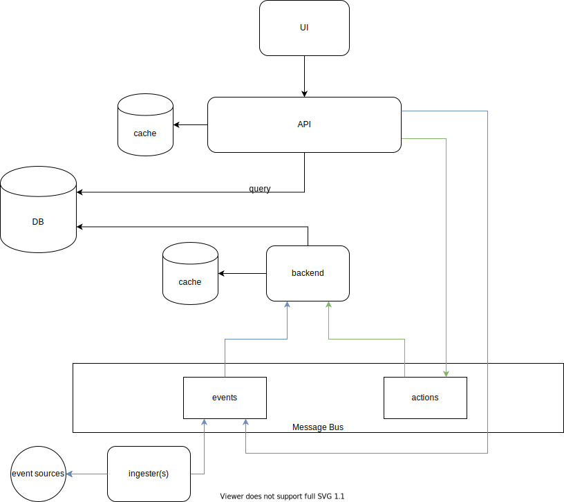

# Architecture Overview

# Components

## Message Bus
Bus to allow for communication of events/messages between services. Two main message types exists:

 - event messages - These are the monitoring events. They are created by either ingestors or pushed via the API.

 - actions - An action message, generated by the API, is any modification request to an event.

## Ingesters
Ingestors are any generic service that can push events to the message bus. The could either be entirely third party services, or maybe generic ingestors could be built.

## Backend
Main backend service that process the monitoring events. It is responsible for the following:
- Creation of events and alerts in the DB
- De-duplicate events into alerts
- Set the alert grouping key

The backend is the only service that **writes any modifications** to the backend. It has a cache to store temporary data such as for enrichment.

## API
The API service allows for external applications to interact with the events. Notably, it is responsible for:
- Providing a query endpoint for the events
- Expose actions that can be triggered on events
- Allows events to be pushed to it

## UI
API-driven UI to visualize the events. It must stay decoupled from the API to ensure all actions be API-first. 

## DB
The database stores the events. A NoSQL database is prefered. The database could be split between "hot" db for active events, and "cold" db for historical data.